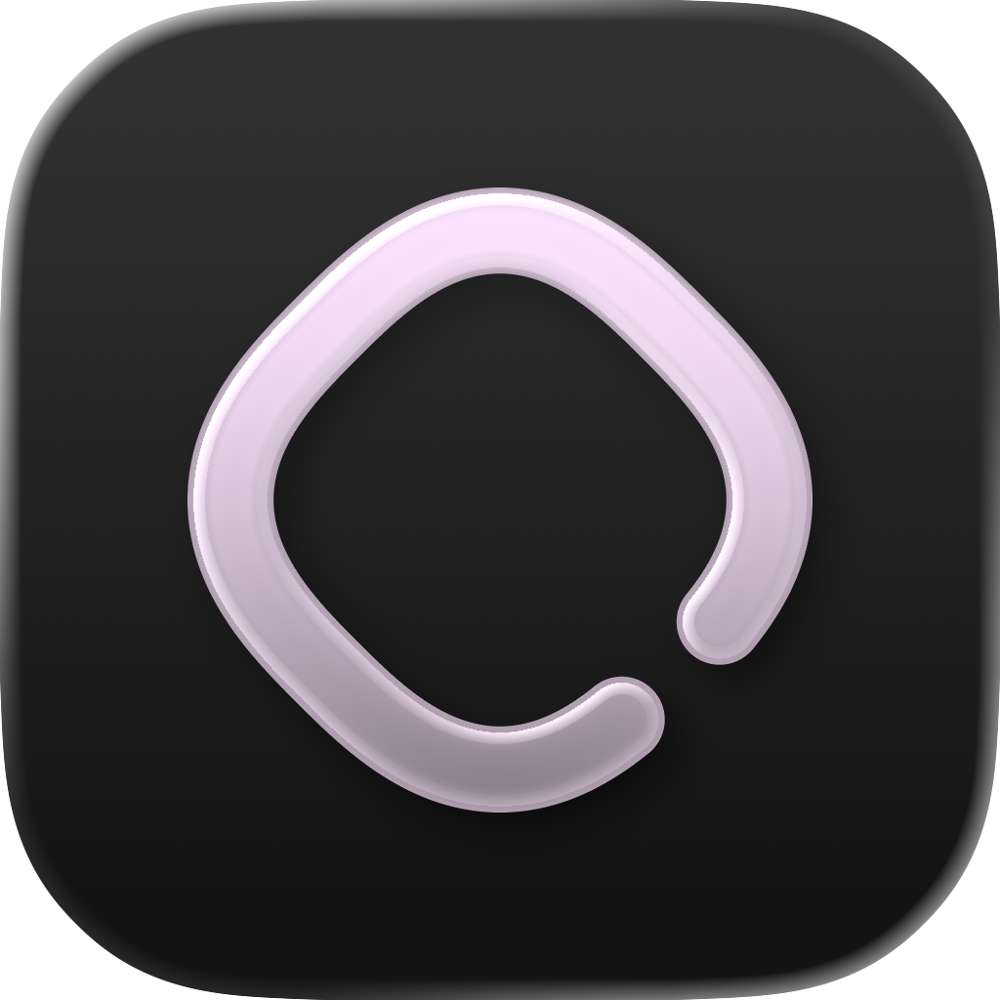

  

<h1 align="center">Aloud</h1>

A Mac app that reads your notes, papers, and PDFs aloud with the voices already on your Mac.

---

## Why it exists

Most of us have a folder that grows faster than we read it: meeting notes, chat transcripts, papers saved for the weekend, books with no audiobook, Markdown written at midnight.
Listening fits into a walk or a commute in a way reading does not.
The read-aloud apps I tried wanted the files uploaded, then an account, then a subscription.
A Mac already ships with good voices, so Aloud is the small piece that hands them your files.

## How it works

Point Aloud at folders you already have.
It reads `.md`, `.txt`, and `.pdf` in place and never copies or uploads them, so an Obsidian vault works as it stands.

Or copy a paragraph in any app and press Option+Space.
A small card appears under the menu bar with the text's title, its length, and a Play button.
Space plays it, and nothing is written to disk until you do.
Text you have played before opens the note it already became rather than a duplicate.
Option+Space again pauses the reading, and Space resumes it.

## What it does

- Reads Markdown as prose: headings, lists, links, and tables come out the way a person would say them, and code blocks can be skipped.
- Cleans PDFs first: running headers, page numbers, and hyphen breaks are removed before the voice sees them.
- Highlights the sentence and the word being read. Click any sentence to jump to it.
- Remembers where you stopped in every document and marks it Finished at the end.
- Bookmarks a document from the reader or its card.
- Offers ten speeds from 0.75x to 3x, a quarter apart. A change takes effect on the current sentence.
- Lets you preview every voice on the Mac before picking one, with seven recommended voices at the top of the list.
- Skips back and forward 10 seconds, always to a sentence boundary.
- Reads in sans or serif type, at five sizes, in light or dark.
- Edits `.md` and `.txt` in place, saving on Done, on blur, and on Cmd+S.
- Keeps reading with the window closed. There is a menu bar player, the media keys and AirPods work, and the Now Playing card in Control Center shows what is playing. It pauses when you unplug your headphones.
- Searches titles and full text across every folder as you type.

Aloud has no account, sends nothing off your Mac, and costs nothing.
It is open source under the MIT license.

## Try it

Aloud needs macOS 26.

    git clone https://github.com/kevxuUmich/Aloud.git
    cd Aloud
    make dev

That builds the app and opens it.
Add a folder, or copy some text and press Option+Space.

### The signed build

The sandboxed, signable app needs Xcode 26.

    brew install xcodegen
    xcodegen generate

Open `Aloud.xcodeproj` and sign with your team.
Launch at login goes through `SMAppService` and works only in that signed, bundled build.
The project file is written from `project.yml` and is not in git.

### Developing

    brew install watchexec xcodegen
    make watch      # rebuild and relaunch on save
    make gallery    # the component page
    make test
    make check

Four library targets hold the rules about text, timing, and geometry, each with its own tests, and the app only draws.
It is Swift 6 with strict concurrency, so a data race is a compile error.

    .build/Aloud.app/Contents/MacOS/Aloud --say path/to/file.md   # speak a file from the terminal
    .build/Aloud.app/Contents/MacOS/Aloud --silent                # run with a fake voice for UI work
