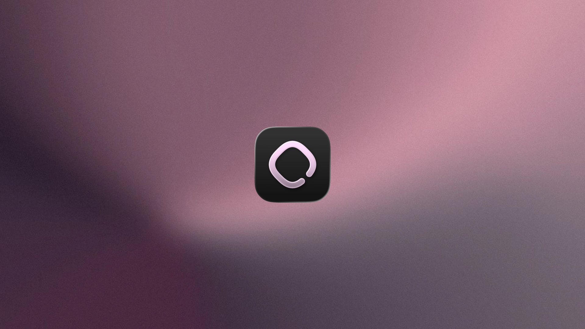

  

<h1 align="center">Aloud</h1>

A Mac app that reads your notes, papers, and PDFs aloud with the voices already on your Mac.

---

## Why it exists

Most of us have a folder that grows faster than we read it: meeting notes, chat transcripts, papers saved for the weekend, books with no audiobook, Markdown written at midnight.
Listening fits into a walk or a commute in a way reading does not.
The read-aloud apps I tried wanted the files uploaded, then an account, then a subscription.
A Mac already ships with good voices, so Aloud is the small piece that hands them your files.

## How it works

Aloud has two ways in: the folders you already keep, and the text in front of you.

- **Point it at folders you already have.**
  It reads `.md`, `.txt`, and `.pdf` in place and never copies or uploads them, so an Obsidian vault works as it stands.
- **Or select a paragraph in any app and press Option+Space.**
  A small card appears under the menu bar with the text's title, its length, and a Play button.
  The card wears the icon of the app the text came from, and names the site when it was a web page.
  Nothing is written to disk until you play it.
- **A note you play remembers where it came from.**
  The app and the page go into the note's front matter, never a file path, so the player shows the same icon after a relaunch.
  Text a password manager marks as concealed is never read.
- **Text you have played before opens the note it already became**, rather than a duplicate.
- **Reading the selection needs the Accessibility permission**, which Aloud asks for the first time.
  Without it, and in the few apps that keep their selection to themselves, the card reads the clipboard instead, so copying always works.
- **The hotkey can be rebound** in Settings.

### Shortcuts

Anywhere on the Mac:

| Keys | Does |
| --- | --- |
| Option+Space | Read the selection, or the clipboard, in the app in front |
| Option+Space while reading | Pause |

While the card is up:

| Keys | Does |
| --- | --- |
| Space or Enter | Play |
| Escape | Dismiss the card |
| Up / Down | Volume |
| Option+Up / Option+Down | Speed |

In the window:

| Keys | Does |
| --- | --- |
| Space | Play and pause |
| Left / Right | Skip back or forward 10 seconds |
| Up / Down | Volume |
| Option+Up / Option+Down | Speed |
| Cmd+= / Cmd+- | Larger or smaller text |
| Cmd+Shift+V | New note from the clipboard |
| Cmd+S | Save while editing |
| Enter | Open the selected document or folder |
| Delete | Move the selected documents to the Trash |
| Cmd+A / Escape | Select every card, or none |

The media keys and AirPods work too.

## What it does

- Reads Markdown as prose: headings, lists, links, and tables come out the way a person would say them, and code blocks can be skipped.
- Cleans PDFs first: running headers, page numbers, and hyphen breaks are removed before the voice sees them.
- Highlights the sentence and the word being read. Click any sentence to jump to it.
- Remembers where you stopped in every document and marks it Finished at the end.
- Bookmarks a document from the reader or its card.
- Offers eleven speeds from 0.5x to 3x, a quarter apart. A change takes effect on the current sentence.
- Lets you preview every voice on the Mac before picking one, with seven recommended voices at the top of the list.
- Adds seven Kokoro voices, neural voices Apple does not ship, as a one-time download from Aloud's own releases that then runs entirely on your Mac.
- Skips back and forward 10 seconds, always to a sentence boundary.
- Reads in sans or serif type, at five sizes, in light or dark.
- Edits `.md` and `.txt` in place, saving on Done, on blur, and on Cmd+S.
- Keeps reading with the window closed. There is a menu bar player, the media keys and AirPods work, and the Now Playing card in Control Center shows what is playing. It pauses when you unplug your headphones.
- Searches titles and full text across every folder as you type.
- Selects like Finder: click a card, Shift-click a range, Cmd-click to add one, or drag a box around several. Double-click opens. The right-click menu acts on the whole selection.

Aloud has no account, sends nothing off your Mac, and costs nothing.
The one thing it ever downloads is the Kokoro voice models, once, from Aloud's own GitHub release, and only when you pick one of those voices.
It is open source under the MIT license.

## Try it

Aloud needs macOS 26.

    git clone https://github.com/kevxuUmich/Aloud.git
    cd Aloud
    make dev

That builds the app and opens it.
Add a folder, or select some text and press Option+Space.

### The signed build

The sandboxed, signable app needs Xcode 26.

    brew install xcodegen
    xcodegen generate

Open `Aloud.xcodeproj` and sign with your team.
Launch at login goes through `SMAppService` and works only in that signed, bundled build.
The project file is written from `project.yml` and is not in git.

### Developing

    brew install watchexec xcodegen
    make watch      # rebuild and relaunch on save
    make gallery    # the component page
    make test
    make check

Four library targets hold the rules about text, timing, and geometry, each with its own tests, and the app only draws.
It is Swift 6 with strict concurrency, so a data race is a compile error.

    .build/Aloud.app/Contents/MacOS/Aloud --say path/to/file.md   # speak a file from the terminal
    .build/Aloud.app/Contents/MacOS/Aloud --silent                # run with a fake voice for UI work
